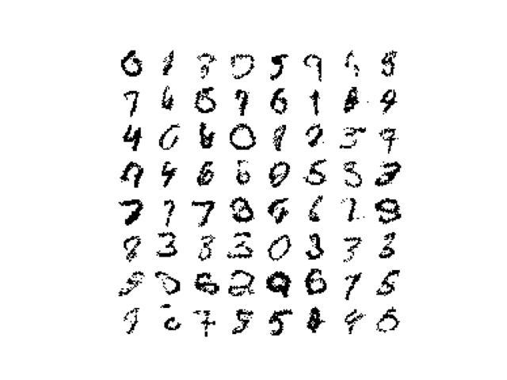
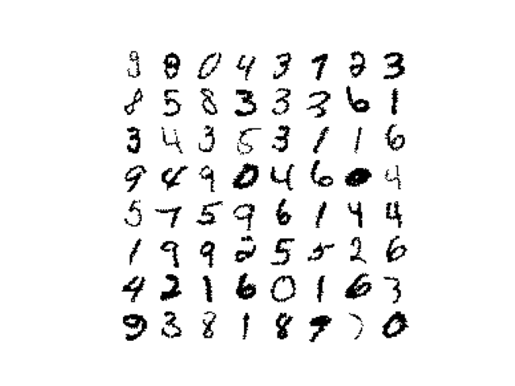
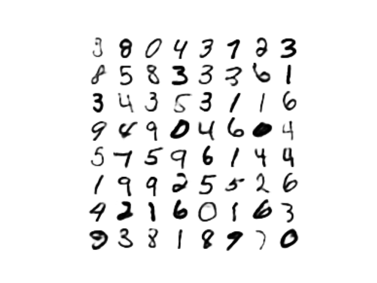
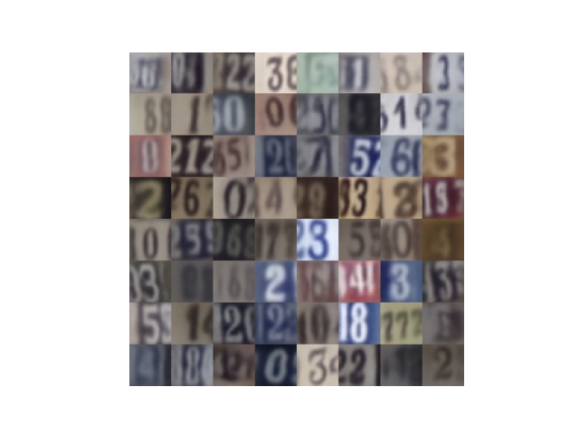
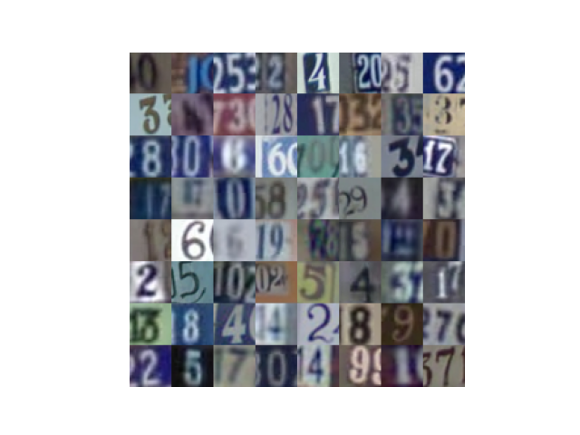
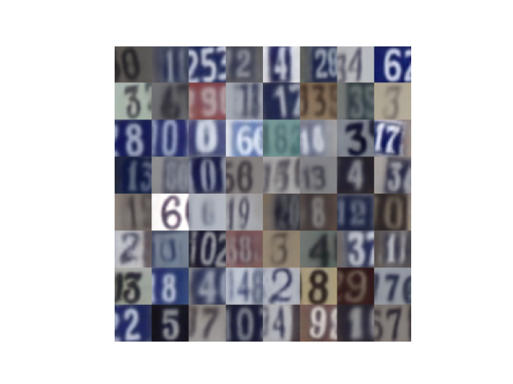
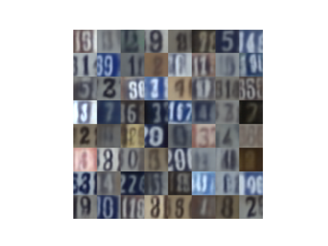
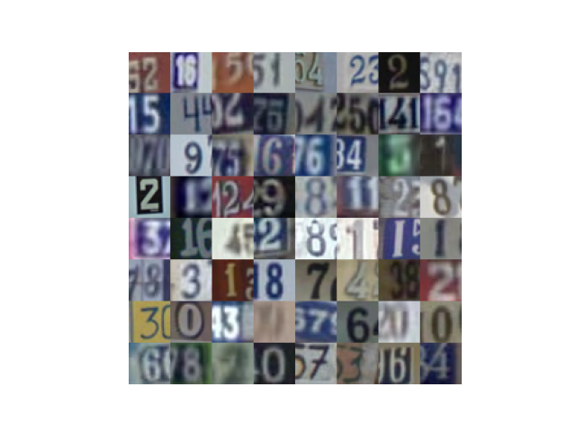
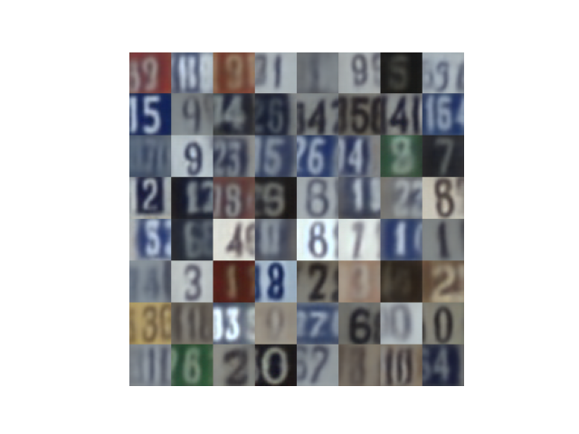

# vae-mdl
VAE with mixture of discretized logistics

## Resources
[transformers from scratch](https://towardsdatascience.com/7-things-you-didnt-know-about-the-transformer-a70d93ced6b2)

[Efficient VDVAE](https://github.com/Rayhane-mamah/Efficient-VDVAE)

https://github.com/addtt/ladder-vae-pytorch
https://github.com/addtt/ladder-vae-pytorch/blob/master/lib/likelihoods.py#L117

## Architectures:
https://github.com/AntixK/PyTorch-VAE/blob/master/models/vanilla_vae.py

## Notes
In a decoder, if you are using `stride=2` from your second-to-last to last layer, each set of 2x2 pixel is a linear projection of some single pixel in the previous layer. Maybe that is not desirable. Instead have one more conv layer in the end with `stride=1`  

## Learnings:
In the loss I was reducing over last three axes, but when I changed the latent variable to dense from h, w, c this caused trouble. 

## Resources:
- [VDVAE](https://github.com/openai/vdvae), [simple VDVAE](https://github.com/vvvm23/vdvae)
- [Efficient VDVAE](https://github.com/Rayhane-mamah/Efficient-VDVAE)
- [LVAE havtorn](https://github.com/JakobHavtorn/vae)  [HVAE](https://github.com/JakobHavtorn/hvae-oodd), [LVAE dittadi](https://github.com/addtt/ladder-vae-pytorch)
- [OODD](https://github.com/JakobHavtorn/hvae-oodd)
- [NVAE](https://github.com/NVlabs/NVAE), [simple NVAE](https://github.com/GlassyWing/nvae), [very simple NVAE](https://github.com/kartikeya-badola/NVAE-PyTorch)
- [BIVA](https://github.com/vlievin/biva-pytorch)
- [OpenAI Residual blocks](https://github.com/openai/vdvae/blob/main/vae.py)
- [bjkeng blog](https://github.com/bjlkeng/sandbox/blob/master/notebooks/pixel_cnn/pixelcnn-test_loss_pixelconv2d-multi-image.ipynb)
- [pixel-cnn DMoL](https://github.com/openai/pixel-cnn) [openai DMol](https://github.com/openai/vdvae/blob/main/vae_helpers.py)

https://github.com/rasmusbergpalm/vnca/blob/dmg-double-celeba/vae-nca.py
https://github.com/rasmusbergpalm/vnca/tree/dmg_celebA_baseline
https://github.com/rasmusbergpalm/vnca/blob/dmg_celebA_baseline/modules/vae.py#L88
https://github.com/rasmusbergpalm/vnca/blob/dmg-double-celeba/vae-nca.py#L282

https://drive.google.com/file/d/1IrPBblLovAImcZdWnzJO07OxT7QD9X2m/view
https://github.com/rll/deepul/blob/master/deepul/hw3_helper.py
https://github.com/rll/deepul/blob/master/deepul/utils.py
https://github.com/rll/deepul/blob/master/homeworks/solutions/hw3_solutions.ipynb

## Celeb_a data:
https://github.com/nv-tlabs/CLD-SGM  
https://github.com/openai/glow  

# Story
First we verify our setup by reproducing the original IWAE results in `model01.py`.

| Importance samples | Test-set LLH (5000 is) |
| --- | --- |
| 5 | -85.02 |

<table>
    <tr>
    <td>Model samples</td><td>Images</td><td>Reconstructions</td>
    </tr>
    <tr>
        <td valign="middle" align="center">  </td>
        <td>  </td>
        <td>  </td>
    </tr>
</table>

| Models samples | Images | Reconstructions |
| --- | --- | --- |
|  |  |  |

It is very common to see improper losses used in place of $\log p(x|z)$. 
For example the binary cross entropy used for non-binary data or MSE loss, which implies a Gaussian loss with fixed variance = 1. 
These approaches generate qualitatively good samples from relatively simple models, if you just take the mean from $p(x|z)$ and don't sample from it.
In the case of the binary cross entropy, sampling would mean all pixel values either 0 or 1. In the case of MSE loss (Gaussian with variance 1), the noise overwhelms the mean function.
I have a feeling that these methods are easy to fit because they act like pseudo-flow models, where all the sample variation is in the prior. Or like GANs (which are not easy to fit though).

We illustrate this with a Gaussian observation model $p(x|z)$ in `model02.py`. 
The variance is lower bounded at $exp(-1)$ by putting a tanh activation on the log variance.
Models that use this Gaussian with lower bounded variance loss or the MSE loss with good results can be seen here: [AntixK](https://github.com/AntixK/PyTorch-VAE).  
Samples from the model look fine, but if the lower bounding on the variance is removed, they become horrible - try it out.

| Models samples | Images | Reconstructions |
| --- | --- | --- |
|  |  |  |

A Gaussian observtaion model for pixel values may not be appropriate in itself. The mixture of discretized logistics is basically what everybody is using now. 
There is a lot the MoDL loss, so in `model03.py` let's try out a plain discretized logistic distribution instead. 
The logistic distribution is somewhat similar to a gaussian, where the continuous distribution is being binned into a discrete pmf.
The same phenomenon is seen here: with a lowerbounding of the variance samples from the model look reasonable, while removing the lower bounding destroys the samples.

| Models samples | Images | Reconstructions |
| --- | --- | --- |
|  |  | | 

So we have some kind of misspecification of our generative model. We have a few options for mitigating this  

* The convolutional archtectures have been simple so far, maybe a more complex architecture helps
* The MoDL loss as typically used has an autoregression over the RGB channels, maybe this helps
* The current setup only has one stochastic layer for the latent variable $z$, while current approaches have multiple stochastic layers. Maybe this is what balances the observation model loss vs the KL losses
* The beta-VAE has a reweighting of the KL, which helps produce better samples when beta is tuned correctly. This is equivalent to lower bounding the variance in the observation model so we won't look at this approach.

<table>
  <tr>
    <td> </td>
    <td></td>
   </tr> 
   <tr>
      <td></td>
      <td></td>
  </tr>
</table>

# TODO:
- implement a merge/unmerge layer for handling importance samples  
- keep track of stochastic layers with Dicts? or something else? look at Rust collections and how they are indexed
